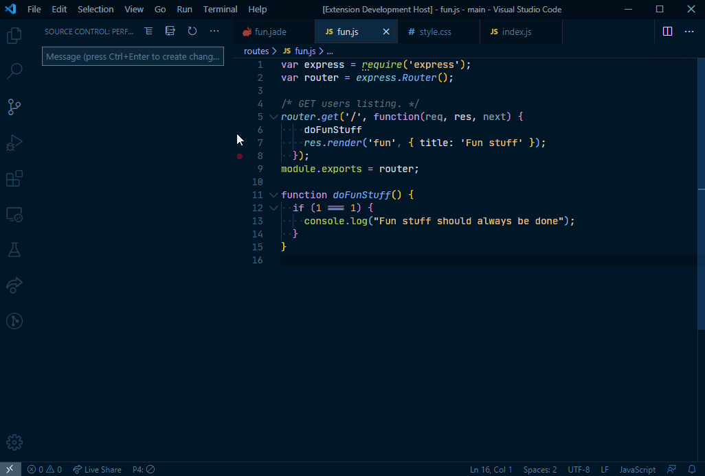

# vscode-perforce

[](https://github.com/mjcrouch/vscode-perforce/issues)
[](https://dev.azure.com/mjcrouch/vscode-perforce/_build/latest?definitionId=1&branchName=master)  
[](https://david-dm.org/mjcrouch/vscode-perforce)
[](https://david-dm.org/mjcrouch/vscode-perforce?type=dev)  
[](https://github.com/mjcrouch/vscode-perforce/blob/master/LICENSE.txt)
[](https://marketplace.visualstudio.com/items/mjcrouch.perforce)  

Perforce integration for Visual Studio Code

This is a fork of the `slevesque.perforce` extension, published in 2020, as the original creator now appears to be inactive on GitHub.

If you install this extension, please uninstall or disable `slevesque.perforce` to prevent issues with duplicate icons.



## Commands

* `add` - Open a new file to add it to the depot
* `edit` - Open an existing file for edit
* `revert` - Discard changes from an opened file
* `diff` - Display diff of client file with depot file
* `diff revision` - Display diff of client file with depot file at a specific revision
* `info` - Display client/server information
* `login`, `logout` - Login operations

## Configuration

|Name                               |Type       |Description
|-----------------------------------|-----------|-----------
|`perforce.client`                  |`string`   |Use the specified client
|`perforce.user`                    |`string`   |Use the specified user
|`perforce.port`                    |`string`   |Use the specified protocol:host:port
|`perforce.password`                |`string`   |Use the specified password
|&nbsp; 
|`perforce.editOnFileSave`          |`boolean`  |Automatically open a file for edit when saved
|`perforce.editOnFileModified`      |`boolean`  |Automatically open a file for edit when Modified
|`perforce.addOnFileCreate`         |`boolean`  |Automatically Add a file to depot when Created
|`perforce.deleteOnFileDelete`      |`boolean`  |Automatically delete a file from depot when deleted
|&nbsp; 
|`perforce.dir`                     |`string`   |Overrides any PWD setting (current working directory) and replaces it with the specified directory
|`perforce.command`                 |`string`   |Configure a path to p4 or an alternate command if needed
|`perforce.realpath`                |`boolean`  |**Experimental** Try to resolve real file path before executing command
|&nbsp; 
|`perforce.activationMode`          |`string`   |Controls when to activate the extension (`always`,`autodetect`,`off`)
|`perforce.countBadge`              |`string`   |Controls the badge counter for Perforce (`all`,`off`)
|`perforce.annotate.enable`         |`boolean`  |Show annotation for every file
|`perforce.annotate.changelist`     |`boolean`  |Output changelist numbers rather than revision numbers for each line
|`perforce.annotate.user`           |`boolean`  |Output the user who modified the line in the file and the date it was modified
|`perforce.changelistOrder`         |`string`   |Specifies the direction of the chnagelist sorting (`descending`,`ascending`)
|`perforce.scmFileChanges`          |`boolean`  |Open file changes when selected in SCM Explorer
|`perforce.ignoredChangelistPrefix` |`string`   |Specifies the prefix of the changelists to be ignored.
|`perforce.hideNonWorkspaceFiles`   |`boolean`  |Hide non workspace files in the SCM Explorer. Default changelist only submits files that are opened in current workspace. Warning: If you submit other changelists than the default it will submit files that are not visible.
|`perforce.swarmHost`               |`string`   |Specifies the hostname of the Swarm server for annotation links. (`https://localhost`)
|`perforce.hideShelvedFiles`        |`boolean`  |Hide shelved files in the SCM Explorer.
|`perforce.hideEmptyChangelists`    |`boolean`  |Hide changelists with no file in the SCM Explorer.
|&nbsp;
|`perforce.bottleneck.maxConcurrent` |`number`  |Limit the maximum number of perforce commands running at any given time.

## Activation

You must properly configure a perforce depot area before the extension activates.

You can specify how you want the extension to activate by setting the parameter `perforce.activationMode`

* `autodetect` (default) - The extension will only activate if it detects a valid perforce client that contains the workspace root, or a `.p4config` file in the workspace. If one is not detected, perforce commands will not be registered with VSCode, but you will be able to view the perforce output log to see why the extension did not activate
* `always` - Always try to activate the extension, even if a valid client was not found. This may be useful if you want to use perforce commands on files outside of the workspace, **and** you either have perforce set up properly with .p4config files for that area, or you have manually specified a user / client / port etc in your vscode configuration. Otherwise, you should probably avoid this setting
* `off` - Don't try to activate the extension. No perforce log output will be produced

The following can be set in VSCode user or workspace settings to properly detect the perforce depot
```json
{
    "perforce.user": "your_user",
    "perforce.client": "your_client",
    "perforce.port": "example.com:1666"
}
```

You can also create a `.p4config` file at the root of your workspace with perforce variables
```
P4USER=your_user
P4CLIENT=your_client
P4PORT=example.com:1666
```
More detail in [Perforce Documentation](https://www.perforce.com/perforce/r17.1/manuals/cmdref/index.html#CmdRef/P4CONFIG.html?Highlight=p4config)

## Multi-root support

You can specify the following settings per workspace:
* `perforce.client`
* `perforce.user`
* `perforce.port`
* `perforce.password`
* `perforce.dir`

This allows you to work with different repository within the same editor.
See [Multi-root Workspaces - Settings](https://code.visualstudio.com/docs/editor/multi-root-workspaces#_settings) for more details.

## Status bar icons

*  opened for add or edit
*  not opened on this client
*  not under client's root

## SCM view
  

Explore and leave your comments on [GitHub](https://github.com/mjcrouch/vscode-perforce/issues)

## Common Questions

#### **Q:** Nothing works and vscode cannot find the commands
**A:** Ensure you have a perforce area set up. If all else fails, try setting
`perforce.client`, `perforce.user` and `perforce.port` to the right values for your depot and workspace, and then reload the window. If that does not work, continue below:

#### **Q:** Something is not working
**A:** Here are a few steps you should try first:
1. Look at the logs with `Perforce: Show Output`
1. Search for the [existing issue on GitHub](https://github.com/mjcrouch/vscode-perforce/issues?utf8=✓&q=is%3Aissue)
1. If you can't find your problem, [create an issue](https://github.com/mjcrouch/vscode-perforce/issues/new), and please include the logs when possible

#### **Q:** Does it work with Remote-SSH?
**A:** Yes - you will need to install the extension on the remote instance of VSCode, using the normal extensions view
  
#### **Q:** I'm using this old thing called *Source Depot*...
**A:** I don't think you exist, since Microsoft has migrated to git. Compatibility mode has been removed.
If i'm wrong, and you do exist, the original slevesque version of this extension provides a compatibility mode setting, which may or may not work
[original issue...](https://github.com/stef-levesque/vscode-perforce/issues/47)

## Installation

1. Install *Visual Studio Code* (1.19 or higher)
2. Launch *Code*
3. From the command palette `ctrl+shift+p` (Windows, Linux) or `cmd+shift+p` (OS X)
4. Select `Install Extensions`
5. Choose the extension `Perforce for VS Code` by `mjcrouch`
6. Reload *Visual Studio Code*

## Contributing

[Guide to contributing](CONTRIBUTING.md)

## Requirements

Visual Studio Code v1.19

## Credits

* [Visual Studio Code](https://code.visualstudio.com/)
* [vscode-docs on GitHub](https://github.com/Microsoft/vscode-docs)

## License

[MIT](LICENSE.md)
